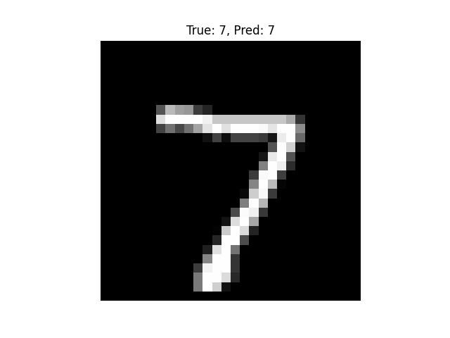
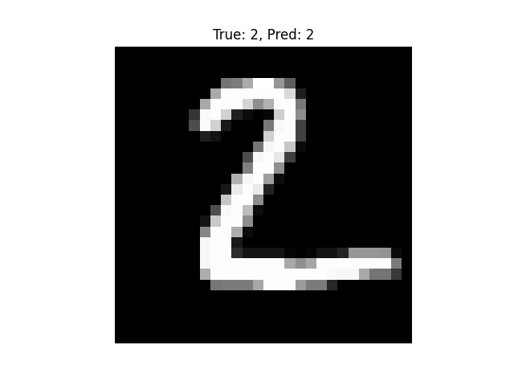
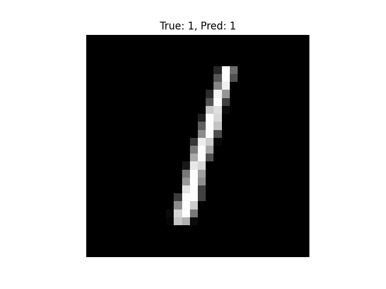
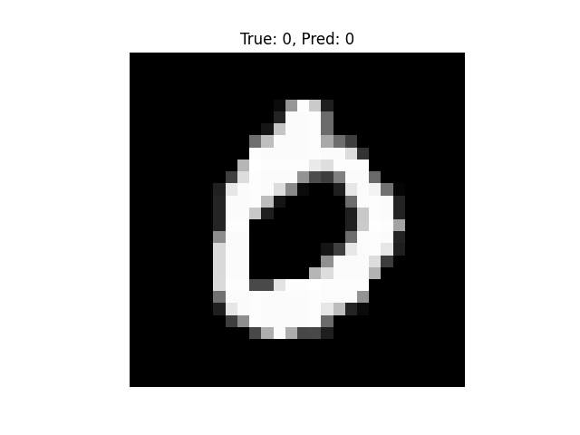
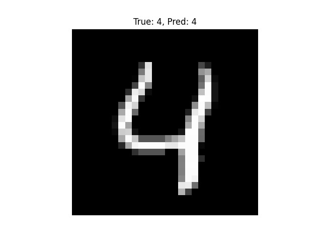
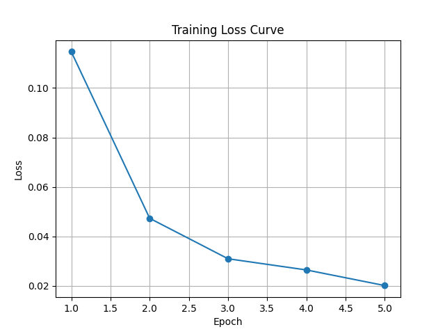

# MNIST CNN Image Classification

This project implements a **Convolutional Neural Network (CNN)** using **PyTorch** to classify handwritten digits from the **MNIST dataset**. It includes training, evaluation, and visualizations of results such as sample predictions and training loss curves.

---

## Features

- Convolutional Neural Network (CNN) for image classification
- Training and testing on MNIST or FashionMNIST dataset
- GPU support if available
- Displays sample images with predictions
- Plots training loss over epochs
- Achieves around **98% accuracy** on MNIST after 5 epochs

---

## Requirements

- Python 3.8+
- PyTorch
- torchvision
- matplotlib
- numpy

Install dependencies using pip:

```bash
pip install torch torchvision matplotlib numpy
```
Usage
```bash
Clone the repository or download the mnist_cnn.py file.
```

Run the script:

```bash
python mnist_cnn.py
```

The script will automatically download the MNIST dataset (or FashionMNIST) if not already present.

Training progress will be shown in the console.

After training, test accuracy will be printed.

Visualizations:

Displays sample images with true vs predicted labels

Plots training loss curve

**Dataset**
MNIST: Handwritten digits dataset with 60,000 training images and 10,000 test images.

Optionally, FashionMNIST can be used if MNIST download fails.


For GPU acceleration, ensure CUDA is installed and available.

To manually download MNIST, place the raw files under ./data/MNIST/raw/ and set download=False in the script.

**Screenshots**

Sample Predictions:
<table>
  <tr>
    <th> Prediction 1</th>
    <th> Prediction 2</th>
    <th> Prediction 3</th>
    <th> Prediction 4</th>
    <th> Prediction 5</th>
  </tr>
  <tr>
    <td> </td>
    <td> </td>
    <td> </td>
    <td> </td>
    <td> </td>
  </tr>
</table>

Training Loss Curve:
<table>
  <tr>
    <th> Training Loss Curve</th>
  </tr>
  <tr>
    <td> </td>
  </tr>
</table>

**References**

PyTorch Documentation
MNIST Dataset
